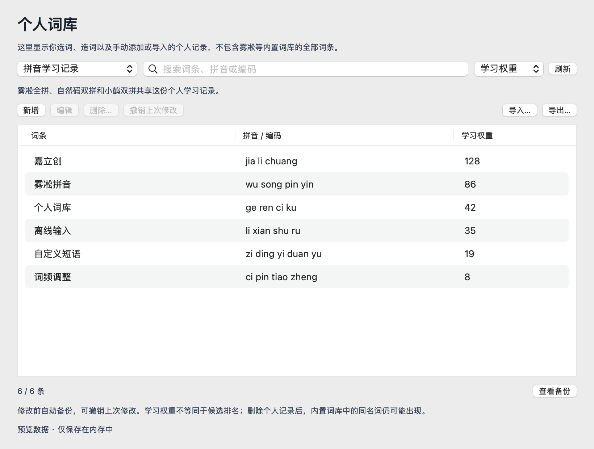

# 个人词库管理

在“设置 → 输入法 → 个人词库”查看和整理个人学习记录。原“词库”页面也提供“管理个人词库…”入口，可直接打开对应分类。

下拉框的“拼音学习记录”“五笔学习记录”“英文学习记录”选择的是个人记录分类。雾凇自带的基础词条由应用提供，不显示在此列表中；个人记录单独保存，并与内置词库共同参与候选生成。内置的雾凇全拼、自然码双拼和小鹤双拼共享一份拼音学习记录，切换这些方案不会切换到另一份个人词库。



## 可用操作

- 切换中文（雾凇拼音）、五笔 86、英文个人词库。
- 按词条、拼音或编码搜索；拼音支持省略音节间的空格进行搜索。
- 按学习权重、词条或编码排序。
- 新增词条，编辑词条文字及编码，删除单条或多条记录。
- 撤销本次输入法进程中的上一次修改；后续学习改变了相关词条时，会提示刷新，避免覆盖新数据。
- 使用原有的学习记录导入、导出功能。

中文新增词条使用完整拼音，音节之间以空格分隔，ü 用 v 表示。多音字按实际读音填写。双拼方案共用中文词库，因此这里仍填写全拼编码。

“学习权重”包括选择和导入记录，不是准确的使用次数，也不是候选名次。编辑词条保留或恢复其学习权重；Rime 的合并规则可能将零权重恢复为 1。当前不提供任意向下修改权重或保证置顶的控件。

删除的是个人学习记录，基础词库中的同名词仍可能显示，也可能在后续输入中重新学到。

## 数据与生命周期

页面仅在打开、刷新或明确修改时读取词库。搜索和排序使用内存中的列表，不轮询数据库，不调用网络或 AI 服务。

所有数据访问沿用 `UserLexiconService` 与 librime 官方 levers 接口。管理操作短暂收束当前 Rime 会话，原有维护通知负责恢复输入；不直接读取或改写运行中的 LevelDB 文件。

读取采用官方的 `词条<Tab>编码<Tab>权重` 导出格式。写入仅提交被修改的记录；删除使用 `UserDbImporter` 支持的负数权重标记。修改前重新校验所选记录，避免旧列表覆盖新学习。编辑先写入新词条，再移除旧词条，并重新导出验证结果；部分写入失败时保留观察到的变更以便撤销。

每种词库最近一次修改前的可移植备份保存在独立用户目录下的 `lexicon-backups/<词库名>-before-edit.tsv`。目录仅当前用户可访问，文件权限为 0600。该备份保存可移植学习权重，不是包含全部内部动态状态的无损快照。下一次修改会更新同种词库的备份；撤销也会保存其操作前的状态。

## 验证

```bash
swift build -c debug
.build/debug/RimeBuffer personal-lexicon-smoke
.build/debug/RimeBuffer user-lexicon-smoke
.build/debug/RimeBuffer settings-routing-smoke
python3 -B scripts/sync-buffer-plugin-catalog.py --check
python3 scripts/lint-log-privacy.py
git diff --check
```

真实引擎验证使用 `personal-lexicon-bridge-smoke`，需设置隔离的 `RIMEBUFFER_USER_DIR` 和包含所需方案的 `RIMEBUFFER_SHARED_DIR`。该测试检查真实的新增、编辑、删除、撤销、无关词条保留及候选召回；不安装或注册输入法。

`personal-lexicon-preview <输出.png>` 使用合成词条渲染原生页面，不读取个人词库。可用 `RIMEBUFFER_APPEARANCE_MODE=day` 或 `night` 检查外观。

实际安装后的输入框兼容性、对话框焦点和大词库操作延迟仍需人工验收，不能仅凭这些 smoke 通过作出保证。
