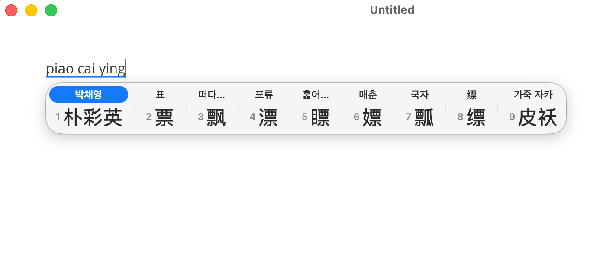
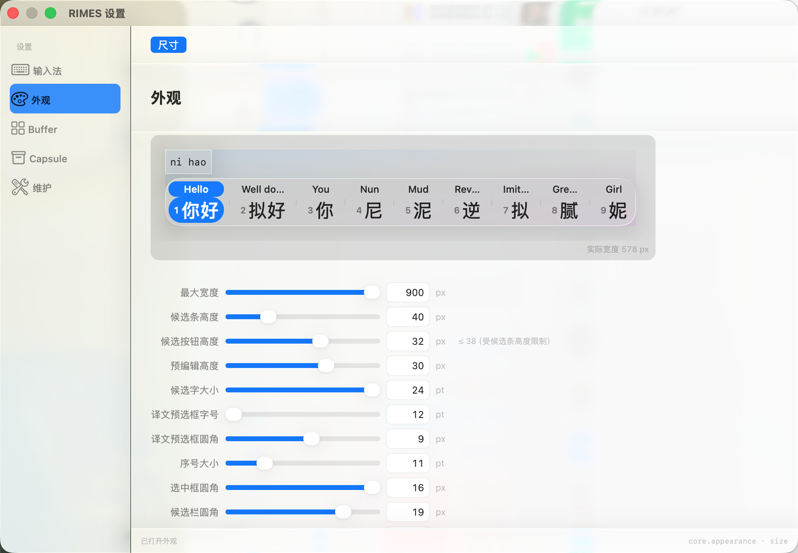

# RIMES

**[中文](README.md)** · **[English](README.en.md)**

RIMES is a Chinese input method for macOS. Built on the Rime engine, it shows a translation above each Chinese candidate so you can compare meanings before committing text.

## Screenshots

Translations align with their Chinese candidates. The selected candidate is highlighted in blue and white.



The settings window uses the same translucent Liquid Glass design:



## Features

- **Multiple Chinese input schemes**: Rime Ice full Pinyin, Natural Code and Xiaohe double Pinyin, Wubi 86, and English input.
- **Per-candidate translations**: Every Chinese candidate gets its own translation, making it easier to distinguish homophones and different meanings. Choose a target language supported by Apple in Settings.
- **Apple Translation**: Candidate translation uses Apple's Translation framework. It is available on macOS 15 and later. Some languages may require language resources to be prepared first; the available choices depend on system support.
- **Liquid Glass appearance**: Liquid Glass is RIMES's default visual style. The candidate bar, settings window, and main surfaces share translucent glass layers, soft edges, and the system accent color. macOS 26 and later use native Liquid Glass materials; earlier versions use compatible system materials and respect macOS's Reduce Transparency setting.
- **Text workbench**: Buffer lets you stage, organize, and review text before delivering it to the focused input field.
- **Capsule**: Browse and manage clipboard history, notes, images, PDFs, and other saved items in one place.

## Requirements

- macOS 13 or later
- Apple Silicon or Intel Mac
- Supported major versions: macOS 13 Ventura, 14 Sonoma, 15 Sequoia, 26 Tahoe, and 27 Golden Gate. The minimum deployment target is macOS 13. See [Apple's macOS version list](https://support.apple.com/en-us/109033) for current names and releases.
- Candidate translation requires macOS 15 or later
- Native Liquid Glass materials are available on macOS 26 and later; macOS 13–15 use compatible system materials

## Install

Visit [GitHub Releases](https://github.com/Kindred5210/rimes/releases) for public installers. If the Releases page has no installer assets yet, a prebuilt package has not been published for that version.

To install a development build from source:

```bash
git clone --branch feat/bilingual-candidate-translation --single-branch https://github.com/Kindred5210/rimes.git
cd rimes
./build_install.sh
```

The script installs the development build in the current user's Input Methods folder and attempts to register and enable RIMES. macOS may ask you to confirm it under **System Settings → Keyboard → Input Sources**.

## Use

1. Select **RIMES** from the macOS input menu.
2. Type Pinyin and browse candidates. Each Chinese candidate has its own translation above it.
3. Open **RIMES Settings → Input Method → Candidate Translation** to choose a target language and prepare language resources when needed.
4. Open **RIMES Settings → Appearance** to view candidate window and interface sizing options.

Settings shortcut: `⌘⇧Z`. It opens while the RIMES input source is active.

## Development

The development installer uses Swift Package Manager to build the app, register the input source, and prepare the Rime runtime:

```bash
./build_install.sh
```

The first build needs network access to fetch Swift and Rime dependencies. The application uses macOS InputMethodKit and AppKit for its native interface, with Rime generating candidates. Schemes and dictionaries are maintained with the project. See [SYSTEM-ARCHITECTURE.md](SYSTEM-ARCHITECTURE.md) for implementation details.

## License and acknowledgments

RIMES-authored code is licensed under the [MIT License](LICENSE). Bundled Rime schemas, dictionaries, and third-party libraries retain their original licenses. See [THIRD_PARTY_NOTICES.md](THIRD_PARTY_NOTICES.md) and `rime-data/licenses/` for details and attribution.

RIMES builds on the [Rime](https://github.com/rime) and [librime](https://github.com/rime/librime) ecosystem. Thanks to the maintainers of these projects and the bundled dictionaries.
