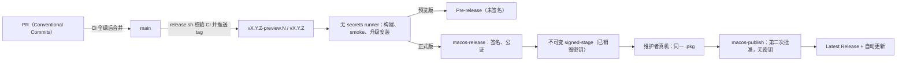

# 发布流程

**合并到 main → CI 全绿 → `./scripts/release.sh <渠道>` → tag → 签名暂存 → 真机同路验收 → 第二次批准 → GitHub Release。**

版本号只来自 tag。发布脚本不修改、不提交任何文件，只在 `origin/main` 上创建并推送一个 tag；
构建、验证、发布说明和 Release 全部由 GitHub Actions 按同一套规则完成。唯一发布中心是
[`scholay/rimes`](https://github.com/scholay/rimes/releases)。



## 渠道

| 渠道 | tag | 命令 | 产物 | 用户如何升级 |
|---|---|---|---|---|
| macOS 预览版 | `vX.Y.Z-preview.N` | `./scripts/release.sh preview` | 未签名 PKG + `SHA256SUMS`，Pre-release | 手动安装，见 [UNSIGNED-PREVIEW.md](UNSIGNED-PREVIEW.md) |
| macOS 正式版 | `vX.Y.Z` | `./scripts/release.sh stable` | Developer ID 签名并公证的 PKG / ZIP + `SHA256SUMS`，Latest | 应用内自动更新 |
| Windows / Linux 数据预览 | `platform-preview-vX.Y.Z` | `./scripts/release.sh platform minor` | 数据与脚本包，Pre-release | 手动安装，见 [CROSS-PLATFORM-PREVIEW.md](CROSS-PLATFORM-PREVIEW.md) |

> Developer Program 资格或一张 Developer ID 证书本身不能把预览版变成正式版。首个正式
> `vX.Y.Z` 必须同时具备同一 Team 的 **Developer ID Application + Developer ID Installer** 证书及私钥、
> 受保护的 `macos-release`（签名与公证）和 `macos-publish`（第二次发布批准、无密钥）Environment，
> 以及 App Store Connect 公证凭据；任一缺失都会 fail-closed。
> 在首个正式包成功发布前，公开 macOS 渠道仍只能是未签名 Pre-release，绝不能把预览版标记为 Latest。
> 完整清单见 [RELEASE-REFERENCE.md](RELEASE-REFERENCE.md#二正式发布环境与-secrets)。

## 一、日常节奏

1. **一个 PR 只做一件事。** 提交信息使用 [Conventional Commits](https://www.conventionalcommits.org/zh-hans/v1.0.0/)：
   `feat(scope): …`、`fix: …`、`perf:`、`refactor:`、`docs:`、`test:`、`build:`、`ci:`、`chore:`、`style:`、`revert:`。
   发布说明由提交信息生成，CI 的「Release tooling」会拒绝不合规的提交。
2. **不直接推送 main。** main 受 ruleset 保护：合并必须经过 PR，且所有 CI 检查通过。
3. **每合并一个用户可见的功能或修复，就发布一个预览版；最迟每周一次。** 发布本身不需要改任何文件。
4. 一条预览线经过真机验证后，只有完整的正式发布前提都满足时才能用 `stable` 转正；Developer ID
   可用并不单独构成发布授权。

## 二、发布一个版本

```bash
git switch main && git pull --ff-only
./scripts/release.sh --dry-run preview   # 查看版本号、门禁结果和发布说明
./scripts/release.sh preview             # 确认后推送 tag
```

| 命令 | 结果 |
|---|---|
| `preview` | 继续进行中的预览线：`v0.5.0-preview.1` → `v0.5.0-preview.2` |
| `preview patch\|minor\|major` | 从最新正式版升级，开始新预览线的 `preview.1` |
| `preview X.Y.Z` | 开始指定的预览线；低于进行中的预览线会被拒绝 |
| `stable` | 把进行中的预览线转正：`v0.5.0-preview.N` → `v0.5.0` |
| `patch\|minor\|major` 或 `X.Y.Z` | 直接发布正式版 |
| `platform patch\|minor\|major\|X.Y.Z` | Windows / Linux 数据预览 |

脚本在推送前逐项检查，任何一项不满足都会拒绝（`--dry-run` 只报告）：

- `origin` 的 fetch / push 地址都指向 `scholay/rimes`；
- 当前在 `main`，工作区干净，`HEAD` 等于 `origin/main`；
- `origin/main` 这个提交的 `CI`、`Platform Preview Data`、`Windows Native Foundation` 都已通过；
- 新 tag 不存在，并高于同渠道已发布的版本；
- `Info.plist` 版本仍是占位值，预置插件 catalog 已同步；
- 正式版还要求 `macos-release` 与 `macos-publish` 都存在；二者都要有非空 required reviewers、禁止
  administrator bypass，并以 selected branch/tag policy 允许 `v*`。前者的受保护 job 要求
  Application / Installer 两份证书、同一 Team ID 与公证凭据完整可用，后者不得存放这些凭据。

两个 Environment 表示两次批准，**不要求两名审核者**；同一个 reviewer 可以先批准签名，再在同一安装包的
真机验收通过后批准公开。当前由 `scholay` 发起并分别审核两次，允许 self-review；仍必须通过审批门，
不能以管理员身份跳过审批。以后需要独立复核时，可以另行启用 prevent self-review 并指定其他审核者。

此外，`release tags` ruleset 必须对 `refs/tags/v*` 增加 **creation** 限制，只把 bypass 权限给指定的
发布主体；现有“禁止删除/移动”规则本身不能防止有人直接创建一个 tag。工作流会在导入凭据和创建 Release 前
再次读取两个 Environment，配置变弱或缺失就拒绝继续；不要用直接 `git push` 绕开 `release.sh`。

## 三、tag 推送之后

[`.github/workflows/release.yml`](.github/workflows/release.yml) 接手：

1. **构建**（无 secrets 的 runner）：把 tag 版本写入 `CFBundleShortVersionString`、run number 写入
   `CFBundleVersion`；arm64 与 x86_64 分别构建后用 `lipo` 合并为通用二进制；组装 `RIMES.app` 并执行
   runtime smoke。
2. **预览版**：打未签名 PKG；在一次性 runner 上先安装**最新已发布的 Release**，再安装新包，验证旧 bundle
   已被退役、回执、签名与架构；随后另一台无 secrets 的 runner 被动复核字节并创建 Pre-release。
3. **正式版签名与暂存**：全新 runner 进入受保护的 `macos-release`，以 Developer ID Application 签 app、
   以 Developer ID Installer 签精确 `RIMES-X.Y.Z.pkg`，分别公证并校验；它销毁 keychain / P8 后才上传
   不可变的 five-file signed-stage（pkg、zip、`SHA256SUMS`、说明、manifest）。
4. **维护者同路验收与发布**：维护者下载 staged pkg，先验证后用 macOS Installer 真实安装；只有验收通过才批准
   无密钥的 `macos-publish`。它核验 artifact ID/digest、manifest 与逐文件 SHA-256，绝不重签、重打包或
   重公证，然后以完全相同的字节创建 Latest，并下载公开资产再次读回校验。
5. **发布说明** = 安装与校验说明 + 自动生成的「变更」：自上一版本以来的提交按类型分组，列出合并的 PR
   和完整对比链接。预览版对比上一个 tag，正式版对比上一个正式版。

工作流失败时**不要删除 tag 重来**：修复后发布下一个版本号。tag、资产与 SHA-256 一经发布即不可变，
ruleset 必须禁止删除或移动 `v*` 与 `platform-preview-v*` tag；正式 `v*` 还必须限制创建权限。

## 四、发布前演练

`Release macOS` 工作流在以下情况以演练模式运行完整的构建、打包和升级安装，**不发布**，产物保留 7 天：

- 修改打包相关文件的 PR（`Package.swift` / `Package.resolved`、`Info.plist`、`Resources/`、`rime-data/`、
  `scripts/pkg/`、发布脚本与工作流等）；
- 每天 03:17（北京时间）对 main 的定时运行；
- 在 Actions 页面手动运行（可指定版本号）。

演练默认使用下一次 `release.sh preview` 会得到的版本号，所以演练通过就等于下一个预览版的构建已经过一遍。

## 五、维护者安装通道与正式包一致性

开发维护与正式包验证是两条**互斥**的安装通道；同一用户或正式包测试机一次只选其一。

- **开发维护通道**：`build_install.sh` 面向 checkout 中的当前源码，安装当前用户开发版。它的版本随
  `git describe` 变化；即使本地 smoke 通过，也不能证明正式发布资产。
- **正式包通道**：用户只使用 GitHub 正式 Release 中的精确 `RIMES-X.Y.Z.pkg` 与 `SHA256SUMS`，由
  Installer 安装到 `/Library/Input Methods`。发布前的维护者只可使用签名 job 已清理密钥后生成的 immutable
  signed-stage，不能用本地重打包或普通演练 Artifact 替代它；正式安装器会在能安全核验时退休当前 GUI 用户的
  开发版，因此两条路径不能并存或互相覆盖。

发布工作流会在签名 runner 上被动校验已经签名、公证和 staple 的正式资产，但这不替代维护者的
发布一致性测试。signed-stage 出现后，维护者应运行：

```bash
scripts/rehearse-release-pkg.sh --pkg /absolute/path/RIMES-X.Y.Z.pkg
scripts/rehearse-release-pkg.sh --pkg /absolute/path/RIMES-X.Y.Z.pkg --install-gui
```

第一个命令不安装；第二个命令打开用户也会看到的 Installer，并在安装完成后复核输入源、签名、公证和回执。
通过后记录 tag、资产 SHA-256、macOS 版本和测试设备，再批准 `macos-publish`。公开后 workflow 还会下载正式
Release 的同一批资产读回校验。signed-stage 只是一道发布权威门：GitHub Actions artifact 的访问规则不等于发布
禁运，面向用户的唯一来源始终是 GitHub Release。

## 六、版本号规则

- **tag 是唯一来源。** 仓库里的 `Info.plist` 固定为 `0.0.0-dev`，CI 会拒绝提交真实版本号；
  `build_install.sh` 的开发安装用 `git describe` 命名（如 `0.5.0-preview.1-73-ge4490c8`）。
- 排序：`X.Y.Z-preview.N` 低于 `X.Y.Z`；预览号从 1 开始递增，禁止回退。
- 应用内更新只认严格的 `X.Y.Z`；预览版和开发版不会收到更新提示。

## 七、更新日志

每个 Release 的正文都带有变更列表。[`CHANGELOG.md`](CHANGELOG.md) 由
`python3 scripts/release/release_tool.py changelog --write` 从 tag 生成：发布后在下一个 PR 里顺手更新，
CI 在它落后时会给出警告。

## 八、暂不提供

Homebrew cask 和可用的应用内更新要等首个完整签名、公证的正式版成功发布；Developer ID 单独可用
并不解除这项门禁。没有签名时，把包放进 Homebrew 就意味着让用户移除隔离属性、绕过 Gatekeeper，
这正是 [UNSIGNED-PREVIEW.md](UNSIGNED-PREVIEW.md) 禁止的做法。

## 相关文档

- [RELEASE-REFERENCE.md](RELEASE-REFERENCE.md)：三段式签名/暂存/发布设计、Environment 与 Secrets、自包含 librime、
  安装器、应用内更新、CI、跨平台预览。
- [RELEASE-HISTORY.md](RELEASE-HISTORY.md)：已关闭的发布通道、旧仓库迁移与 RIMES 改名。
- [UNSIGNED-PREVIEW.md](UNSIGNED-PREVIEW.md)：面向用户的预览版下载、校验与安装说明。
- [CROSS-PLATFORM-PREVIEW.md](CROSS-PLATFORM-PREVIEW.md)：Windows / Linux 数据预览的能力边界。
