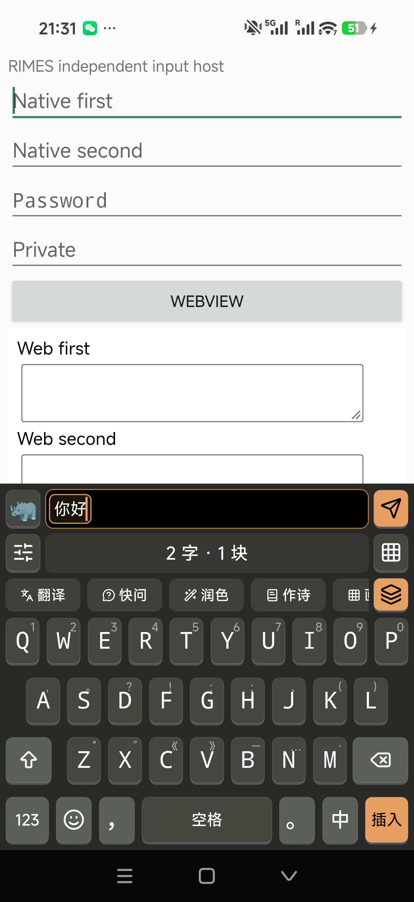
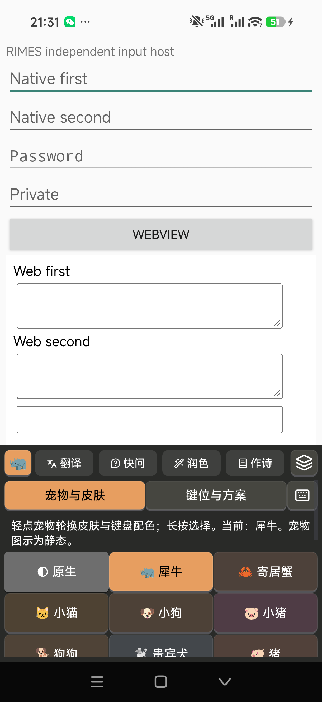

# Android 1.1.2/code16 acceptance — 2026-10-09

Scope: remove duplicate Buffer edit/close controls, make the top-left pet cycle skins, and automatically translate confirmed Buffer text. Wanxiang import/nine-key report was confirmed by the maintainer to be iOS and is tracked separately.

## Changes

- Buffer source/output positions remain as in iOS. Paste and clear are explicit actions in the appearance panel; the duplicate rail controls are removed.
- One visible pet control; tap cycles 18 existing static pet/skin themes, hold opens the chooser. Key layout and schema have a separate tab.
- Translation debounces confirmed text for 400 ms, invalidates on edits, and checks source revision, input-target epoch and plugin installation authorization. Translation output requires explicit Send. Other AI plugins still require Run. AI translation uses the already opt-in provider setting; tests disable remote AI.
- Layout/preferences contracts cover nine-key → QWERTY and schema switches. Android external scheme import remains unavailable.

## GitHub triage

All 23 open issues were read on 2026-10-09: 14 bugs belong to other platforms, and no new open Android bug was identified. Closed Android #62/#63/#64/#68/#69/#70/#72 have no later comments. #76 and other enhancement requests are deferred. This does not claim that all mobile maintenance or enhancement work is complete.

## Automatic checks

- 79 core tests, 15 product-version tests; no failures or skips. Debug/Release builds, app/testhost Lint, production APK/AAB signature and ZIP 16 KB alignment pass.
- Pinned offline resources, licenses and both arm64-v8a/x86_64 ELF 16 KB alignment pass. CI runs the real Android x86_64 engine/learning contracts; final results are linked from [PR #115](https://github.com/scholay/rimes/pull/115).
- On the phone, isolated JNI covers Chinese/non-BMP/NUL conversion, UTF-16 caret and normal/private nine-key schemes. Layout preference contract: 62 checks; plugin backend: 68; attached app settings: 382; pet rendering: 139; height fitting: 319; vector icons: 872; native touch: 18; chord drawing: 23.
- Test fixtures now attach drawing parents correctly, inspect pet accessibility actions in the real IME window, and initialize the isolated JNI user directory before UI fixtures. Settings/JNI contracts refuse to run while their target IME is selected.

## Physical device and upgrade

The Xiaomi 25098PN5AC / Android 16 was upgraded from production 1.1.1/code15 to the signed 1.1.2/code16 candidate with `install -r`. Installed APK bytes matched the staged candidate. The production signer remains SHA-256 `e6228d5b065f1f8c2f1e1162b80ea1a9245ce59a091bb6e403e47936c3820c54`.

| Actual production IME contract | Assertions | Result |
| --- | ---: | --- |
| Automatic local translation, explicit Send, edit/direction invalidation, Retry, hide/field/private gates; other AI Mock plugins | 428 | PASS |
| Community punctuation, held delete, upward symbols, WebView and two chord layouts | 661 | PASS |
| QWERTY/nine-key geometry, themes, composition, emoji, Buffer and orientation | 416 | PASS |
| Real numeric/phone fields and restoration of text-field layout | 191 | PASS |
| Real chord multi-touch, cancellation, Buffer, privacy, target/rotation retirement | 131 | PASS |
| Held touches, target/selection/hide retirement | 97 | PASS |
| Attached pet tap/hold actions and exact hint, skin cycling, one Buffer pet, explicit panel clear | 57 | PASS |
| Total | 1,981 | PASS |

Test preferences were saved privately; remote AI and learning were disabled for synthetic host typing, and original keyboard/plugin preferences were restored and read back. The original default/enabled input methods and rotation settings were restored and verified. No application data was cleared. The final source commit and artifact SHA-256 are recorded in the release's BUILD-INFO.json.

**Dictionary evidence boundary:** the first post-typing whole-directory comparison differed: LevelDB had rotated WAL/manifests/log files and Rime updated schema access metadata. Two pre-existing `.ldb` dictionary tables remained byte-identical. That failed comparison is retained as private evidence and is not reported as whole-dictionary equality. After fixing JNI/UI test isolation, nine real user-directory files remained byte-identical through the isolated contracts, and a separate stopped-IME reinstall preserved all nine fingerprints. This verifies quiescent installation; it does not establish that every logical learning record equals the original pre-typing state. No dictionary contents or credentials are included in this report.

Real phone captures use only synthetic host fields:

## Coverage limits

Android 8, other OEM devices, a 16 KB runtime, long-term daily use and new paid AI-provider requests are not covered by this release's device run. Prior 30-minute runs remain historical evidence. Static pet symbols do not claim iOS animation parity.
