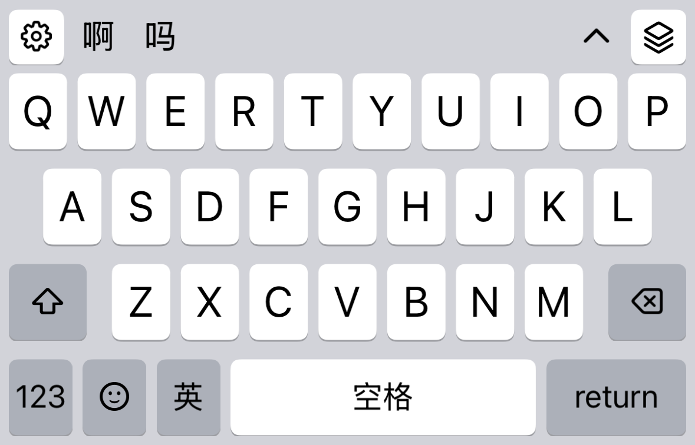

# iOS 导入方案的布局菜单验证 · 2026-10-09

基线 `ea24bb7c64dc38626b42636e3c04fd059cc6d0bb`，独立分支 `codex/ios-wanxiang-layout-20261009`。本次只修正布局菜单的选中状态，未修改万象资源、导入器、引擎、键盘触摸或发布版本。

## 结论

先选内置全拼九键，再启用导入方案时，键盘原本已经使用 QWERTY，但菜单仍勾选记住的九键偏好，且该九键选项被禁用。自然码、五笔和英文也有相同的菜单显示问题。现在菜单按实际可用布局显示 QWERTY；返回内置全拼仍保留九键偏好，显式选择 26 键则保存该选择。

这次未复现“实际键盘锁在九键，无法切到 26 键”。用户的具体版本、导入包与原始宿主尚未取得验证；导入加载失败后返回旧方案、完整访问权限和共享偏好问题也未确认为此次原因。

## 证据

| 检查 | 实测结果 |
| --- | --- |
| 修复前、两项新增回归 | 2 项测试失败，8 个菜单选中状态断言失败；实际 QWERTY 和方案切换可用 |
| 修复后、标准键盘 / 自定义布局 / 导入方案 | 27 项通过、0 失败、0 跳过，套件耗时 21.375 秒 |
| 合成导入方案 | 真实编译资源加载；菜单 QWERTY 选中、九键取消选中且禁用；触发实际布局菜单动作后保留导入方案，已有候选仅确认一次；`nihao → 你好` |
| 同一份万象交付 ZIP | 真实 inspect / installer / deploy / load，通过；26 个字母键，菜单状态正确；`nihao → 你好`，保留导入选择；该测试耗时 12.871 秒 |
| `DEVELOPER_DIR=… swift build -c debug` | Xcode 27 工具链构建通过；存在既有编译警告，未执行 macOS 安装或真实宿主验证 |
| 插件目录一致性与日志隐私检查 | 通过 |

万象 ZIP 为 `lingxi-wanxiang-v18.1.1-base-portable.zip`，33,402,176 字节，SHA-256 `91041724bfca27080184abad84506a423a5dc751759e5cc734e7d5f8c7ae08be`。只读使用已有构建产物，未纳入主工作区未提交的 Catalog / 构建脚本修改。测试中的包资源和用户目录均使用临时隔离目录。

运行环境：任务专用 iPhone 17 Pro 模拟器，iOS 26.5（23F77）、arm64；Xcode 27.0（27A266a）、iPhoneSimulator 27.0 SDK。XCTest 将生产 UIKit 控制器附着到窗口，使用真实 librime 和合成原生 UITextView 代理。记录中有既有初始化路径的 QoS 等待警告，此次没有性能改善结论。



截图来自测试控制器；不是系统键盘扩展或物理 iPhone 截图。未验证物理 iPhone、系统键盘扩展启动、完整访问权限、跨 App Group 持久化或原报告者复测。没有发布到 App Store / TestFlight，不代表本轮 Android 交付。

## 重跑

在任务专用模拟器中将上述固定 SHA 的 ZIP 放入测试宿主 App 的 `Documents/wanxiang-layout-acceptance.zip`。未提供该文件时，固定包测试会明确跳过；两项合成回归仍独立执行。不得在实际用户设备或既有用户模拟器中注入该测试文件。

```sh
DEVELOPER_DIR=/Applications/Xcode.app/Contents/Developer xcodebuild \
  -project platforms/ios/RIMES.xcodeproj -scheme RIMES \
  -destination 'platform=iOS Simulator,id=<task-owned-simulator-udid>' \
  -derivedDataPath platforms/ios/build/DerivedData \
  CODE_SIGN_IDENTITY=- CODE_SIGNING_ALLOWED=YES \
  -only-testing:RIMESTests/StandardKeyboardRuntimeTests \
  -only-testing:RIMESTests/CustomKeyboardRuntimeTests \
  -only-testing:RIMESTests/ImportedSchemeRuntimeTests \
  -resultBundlePath platforms/ios/build/wanxiang-layout-final.xcresult test
```

本地忽略的证据为 `platforms/ios/build/wanxiang-layout-baseline-repro.xcresult` 与 `wanxiang-layout-final.xcresult`。仓库内只保留本报告、源文件哈希和合成输入截图，未提交 ZIP、原始用户词库或偏好。
